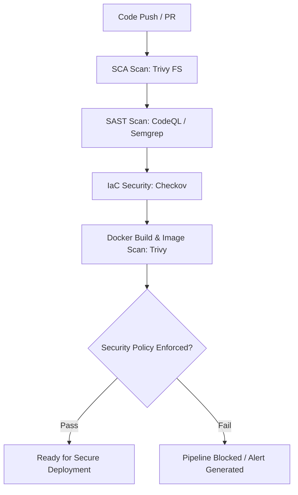

# 🔐 DevSecOps Pipeline Lab

## 📖 Project Overview

This repository hosts a hands-on DevSecOps CI/CD Pipeline built natively within GitHub Actions.

The core mission of this project is to simulate a modern production environment where application features and infrastructure updates cannot hit production without passing rigorous, automated security gates.

Instead of generic hello-world workflows, this lab embeds functional automated security controls spanning SCA, SAST, IaC scanning, and Container Hardening directly into the developer workflow.

---

## 🏗️ Pipeline Architecture & Security Gates

The CI/CD workflow is triggered automatically on every `push` or `pull_request` to the `main` branch.

It orchestrates the following security practices sequentially:



---

## 🛠️ Security Matrix & Tooling

| Phase | Security Practice | Tooling Integration | Focus Area | Status |
|-------|-------------------|---------------------|------------|--------|
| SCA | Software Composition Analysis | Trivy (FS) | Vulnerable dependencies in `requirements.txt` | 🟢 Active |
| SAST | Static Application Security Testing | GitHub CodeQL | Code quality, injection flaws, patterns | ⏳ Planned |
| IaC Scan | Infrastructure as Code Security | Checkov | Misconfigurations in Terraform manifests | ⏳ Planned |
| Container | Container Image Scanning | Trivy (Image) | Base image OS vulnerabilities & layers | ⏳ Planned |
| DAST | Dynamic Application Security Testing | OWASP ZAP | Runtime behavior & active fuzzing | ⏳ Planned |

---

## 📁 Repository Structure

```text
devsecops-pipeline-lab/
├── .github/workflows/
│   └── devsecops-pipeline.yml  # GitHub Actions core pipeline definition
├── app/
│   ├── src/app.py              # Lightweight Python/Flask API serving as the target app
│   ├── requirements.txt        # Managed dependencies (seeded with older components for testing)
│   └── Dockerfile              # Container configuration engineered for hardening scenarios
├── terraform/                  # (Upcoming) Target infrastructure files for IaC linting
└── README.md                   # Lab documentation and operational blueprint
```

---

## 🚀 Lab Roadmap & Key Learnings

This lab acts as an active engineering notebook.

As security policies are implemented, the following metrics and configurations are documented here:

### Dependency Vulnerability Interception (SCA)

Analyzing how underlying libraries impact the attack surface of microservices.

### Container Optimization

Migrating from standard base images to minimal, hardened, or distroless layers while enforcing non-root execution contexts.

### Automated Compliance Gates

Customizing threshold configurations (`exit-code 1` vs `exit-code 0`) to seamlessly balance engineering velocity with baseline organizational risk.

---

## Author

**Roberto Delgado**

*Cybersecurity Engineer*

Cybersecurity professional focused on cloud and infrastructure security, DevSecOps, vulnerability management, and security automation.

This repository is part of my technical portfolio, featuring hands-on projects that demonstrate secure engineering practices across cloud environments, Infrastructure as Code, container security, CI/CD, and security automation.

> **Practical cybersecurity. Secure automation. Continuous learning.**

---

## 📄 License

This project is licensed under the MIT License. See the `LICENSE` file for details.
